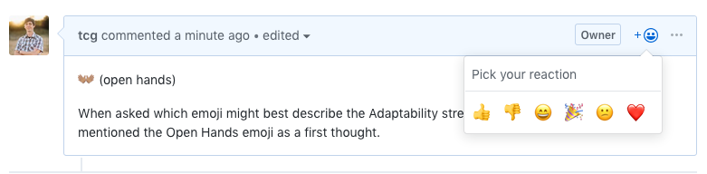

# Emoji Strengths! 
Attempting to assign an emoji to each of the 34 "Strengths".

This is a wildly *unofficial* project to assign an emoji to each of [Gallup, Inc's 34 "StrengthFinder" strengths](https://www.gallupstrengthscenter.com/home/en-us/strengthsfinder). 

# Current Draft (v0.2.0)

The current "selected" set of emoji. We'll version this like other software: If an emoji gets swapped out, we'll consider that a breaking change. 

Please feel free to link these to their respective issues!

| Stength | Emoji |
|------|---|
|[Achiever](https://github.com/tcg/emoji-strengths/issues/4)| ✅ |
|[Activator](https://github.com/tcg/emoji-strengths/issues/10)| |
|[Adaptability](https://github.com/tcg/emoji-strengths/issues/1)| 👐🏽 |
|[Analytical](https://github.com/tcg/emoji-strengths/issues/11)| |
|[Arranger](https://github.com/tcg/emoji-strengths/issues/12)| |
|[Belief](https://github.com/tcg/emoji-strengths/issues/13)| |
|[Command](https://github.com/tcg/emoji-strengths/issues/14)| |
|[Communication](https://github.com/tcg/emoji-strengths/issues/7)| |
|[Competition](https://github.com/tcg/emoji-strengths/issues/5)| |
|[Connectedness](https://github.com/tcg/emoji-strengths/issues/6)| 🕸️ |
|[Consistency](https://github.com/tcg/emoji-strengths/issues/15)| |
|[Context](https://github.com/tcg/emoji-strengths/issues/16)| |
|[Deliberative](https://github.com/tcg/emoji-strengths/issues/17)| |
|[Developer](https://github.com/tcg/emoji-strengths/issues/18)| |
|[Discipline](https://github.com/tcg/emoji-strengths/issues/19)| |
|[Empathy](https://github.com/tcg/emoji-strengths/issues/20)| |
|[Focus](https://github.com/tcg/emoji-strengths/issues/21)| |
|[Futuristic](https://github.com/tcg/emoji-strengths/issues/2)| 🔮 |
|[Harmony](https://github.com/tcg/emoji-strengths/issues/3)| 🕊️ |
|[Ideation](https://github.com/tcg/emoji-strengths/issues/22)| |
|[Includer](https://github.com/tcg/emoji-strengths/issues/23)| |
|[Individualization](https://github.com/tcg/emoji-strengths/issues/24)| |
|[Input](https://github.com/tcg/emoji-strengths/issues/25)| |
|[Intellection](https://github.com/tcg/emoji-strengths/issues/26)| |
|[Learner](https://github.com/tcg/emoji-strengths/issues/27)| |
|[Maximizer](https://github.com/tcg/emoji-strengths/issues/28)| |
|[Positivity](https://github.com/tcg/emoji-strengths/issues/29)| |
|[Relator](https://github.com/tcg/emoji-strengths/issues/30)| |
|[Responsibility](https://github.com/tcg/emoji-strengths/issues/31)| |
|[Restorative](https://github.com/tcg/emoji-strengths/issues/32)| |
|[Self Assurance](https://github.com/tcg/emoji-strengths/issues/33)| |
|[Significance](https://github.com/tcg/emoji-strengths/issues/34)| |
|[Strategic](https://github.com/tcg/emoji-strengths/issues/35)| |
|[Woo](https://github.com/tcg/emoji-strengths/issues/36)| |

# Pull requests for improvements are welcome!

## Process / How to make a suggestion

I'm not sure how best to accomplish this, other than perhaps starting with the following: 

(1) See if an Issue already exists here for the strength in question. Create one, if not!

(2) Make your emoji suggestion in the comments. Of course, you can make multiple suggestions, but let's do one emoji per official suggestion. (See the screenshot below for an example format).

(3) Use the comment reactions feature to vote on yours and others suggestions! (See that screenshot again!)

(4) Use comments to discuss why a particular emoji works, or why it might be better suited to a different strength. 

### Example Screenshot

